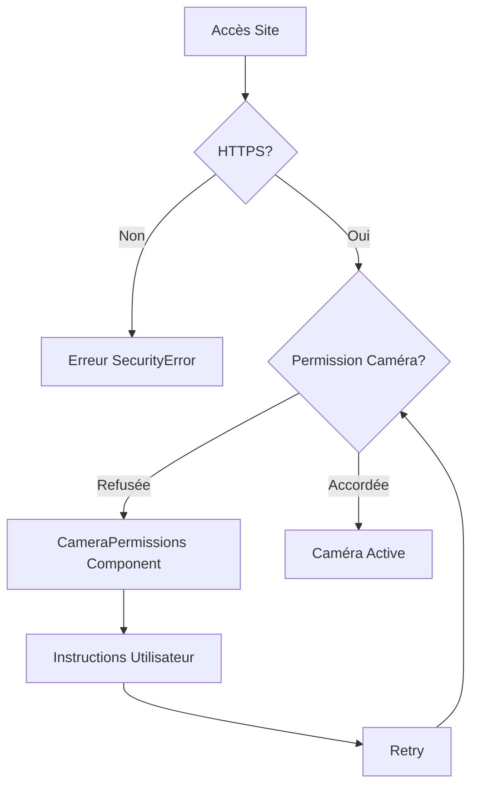

# 🔧 Résolution des Problèmes de Permissions Caméra

## 🚨 Erreurs Corrigées

### 1. **Permissions Policy Violation**
```
[Violation] Permissions policy violation: camera is not allowed in this document.
```

**✅ Solution :** Mis à jour `vercel.json` et `next.config.ts`

### 2. **NotAllowedError: Permission denied**
```
Erreur caméra: NotAllowedError: Permission denied
```

**✅ Solution :** Ajouté composant `CameraPermissions` avec gestion gracieuse

## 🛠️ Corrections Apportées

### 1. **vercel.json** - Permissions Policy
```json
{
  "headers": [
    {
      "source": "/(.*)",
      "headers": [
        {
          "key": "Permissions-Policy",
          "value": "camera=*, microphone=*, geolocation=()"
        },
        {
          "key": "Feature-Policy",
          "value": "camera 'self'; microphone 'self'"
        }
      ]
    }
  ]
}
```

### 2. **next.config.ts** - Headers Configuration
```typescript
async headers() {
  return [
    {
      source: '/(.*)',
      headers: [
        {
          key: 'Permissions-Policy',
          value: 'camera=*, microphone=*, geolocation=()',
        },
        {
          key: 'Feature-Policy',
          value: 'camera \'self\'; microphone \'self\'',
        },
      ],
    },
  ];
}
```

### 3. **CameraPermissions.tsx** - Composant de Gestion
- ✅ Vérification automatique des permissions
- ✅ Messages d'erreur spécifiques par type
- ✅ Instructions utilisateur claires
- ✅ Bouton de retry intelligent

### 4. **CameraCapture.tsx** - Gestion d'Erreurs Améliorée
- ✅ Détection des types d'erreurs spécifiques
- ✅ Intégration avec CameraPermissions
- ✅ Fallbacks gracieux

## 🔍 Types d'Erreurs Gérées

| **Erreur** | **Cause** | **Solution** |
|------------|-----------|--------------|
| `NotAllowedError` | Permission refusée | Composant guide utilisateur |
| `NotFoundError` | Aucune caméra | Message informatif |
| `NotSupportedError` | Navigateur incompatible | Recommandations navigateur |
| `SecurityError` | HTTP au lieu d'HTTPS | Message HTTPS requis |

## 🌐 Compatibilité Navigateurs

### ✅ **Supportés**
- **Chrome/Edge** 85+ (Recommandé)
- **Firefox** 80+
- **Safari** 14+ (limité)

### ❌ **Non Supportés**
- Internet Explorer
- Navigateurs anciens
- Contextes non-sécurisés (HTTP)

## 🔧 Instructions Utilisateur

### **Chrome/Edge**
1. Cliquer sur l'icône 🔒 ou 📷 dans la barre d'adresse
2. Sélectionner "Autoriser" pour la caméra
3. Recharger la page

### **Firefox**
1. Cliquer sur l'icône bouclier dans la barre d'adresse
2. Désactiver la protection pour ce site
3. Autoriser la caméra quand demandé

### **Safari**
1. Aller dans Safari > Préférences > Sites web
2. Sélectionner "Caméra" dans la liste
3. Changer les permissions pour le site

## 🚀 Test en Production

### **Variables d'Environnement Vercel**
```bash
NODE_ENV=production
NEXT_PUBLIC_DEBUG_MODE=false
```

### **Vérifications Post-Déploiement**
1. ✅ Site accessible en HTTPS
2. ✅ Permissions Policy headers présents
3. ✅ Composant CameraPermissions affiché si erreur
4. ✅ Messages d'erreur informatifs

## 🔄 Workflow de Debug



## 📱 Test Mobile

### **Android Chrome**
- ✅ Permissions automatiques
- ✅ Gestion orientation
- ⚠️ Performance limitée

### **iOS Safari**
- ⚠️ Limitations WebRTC
- ✅ Permissions manuelles
- ❌ Pas de vibration

## 🆘 Support

Si les problèmes persistent :

1. **Vider le cache** navigateur
2. **Tester en navigation privée**
3. **Vérifier les extensions** bloquant la caméra
4. **Redémarrer le navigateur**

---

**Status**: ✅ Problèmes de permissions résolus
**Build**: Succès ✓
**Déploiement**: Prêt pour Vercel 