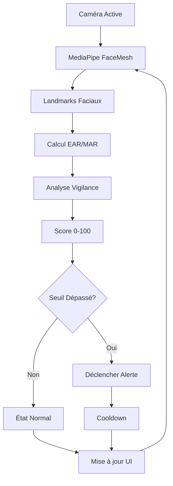

# Guide de Détection Faciale Réelle

## 🚀 Nouvelles Fonctionnalités

L'application utilise maintenant **MediaPipe FaceMesh** pour une **détection faciale en temps réel** au lieu de simulations.

## 🔧 Composants Intégrés

### 1. Hook `useFaceDetection`
- **Localisation** : `src/hooks/useFaceDetection.ts`
- **Fonction** : Gestion de MediaPipe et calculs des métriques
- **Fonctionnalités** :
  - Calcul EAR (Eye Aspect Ratio) basé sur landmarks faciaux
  - Calcul MAR (Mouth Aspect Ratio) pour détecter bâillements
  - Analyse automatique de vigilance
  - Déclenchement d'alertes intelligentes

### 2. Composant `CameraCapture` Amélioré
- **Overlay de détection** en temps réel
- **Sélection de caméra** multiple
- **Indicateurs visuels** de statut
- **Canvas overlay** pour afficher EAR/MAR

### 3. Store Zustand Étendu
- **Gestion caméra** complète
- **Actions détection** en temps réel
- **État vigilance** automatique

## 📊 Métriques Réelles Calculées

### EAR (Eye Aspect Ratio)
```typescript
// Formule : (|p2-p6| + |p3-p5|) / (2*|p1-p4|)
// Seuil par défaut : 0.25
// Valeurs normales : 0.3-0.4
// Yeux fermés : < 0.25
```

### MAR (Mouth Aspect Ratio)
```typescript
// Formule : hauteur / largeur de la bouche
// Seuil par défaut : 0.6
// Valeurs normales : 0.3-0.5
// Bâillement : > 0.6
```

## 🎯 Algorithme de Vigilance

### Score de Vigilance (0-100)
```typescript
let vigilanceScore = 100;

// Pénalités
if (eyesClosed) vigilanceScore -= 40;
if (yawning) vigilanceScore -= 30;

// Normalisation selon qualité EAR
vigilanceScore *= Math.min(ear / 0.4, 1);
```

### Niveaux d'Alerte
- **NORMAL** : Score ≥ 70%
- **DROWSY** : Score 50-70%
- **VERY_DROWSY** : Score 30-50%
- **CRITICAL** : Score < 30%

## 🚨 Système d'Alertes Intelligent

### Cooldown Adaptatif
- **Cooldown par défaut** : 5 secondes
- **Prévention spam** d'alertes
- **Escalade automatique** selon gravité

### Types d'Alertes
1. **Visuelles** : Overlay coloré fullscreen
2. **Sonores** : Web Audio API
3. **Haptiques** : Vibration (mobile)
4. **Persistantes** : Jusqu'à action utilisateur

## 🔄 Flux de Détection



## 🎮 Comment Utiliser

### 1. Démarrage Rapide
```bash
cd drowsiness-detection
npm run dev
```

### 2. Interface Utilisateur
1. **Activer la caméra** via le bouton caméra
2. **Attendre "MediaPipe Ready"** dans l'interface
3. **Démarrer une session** via "Démarrer session"
4. **Observer les métriques** EAR/MAR en temps réel
5. **Tester les alertes** en fermant les yeux

### 3. Indicateurs Visuels
- **Point rouge** : Détection active
- **Valeurs EAR/MAR** : Overlay sur vidéo
- **Status badges** : MediaPipe, caméra, détection
- **Graphiques temps réel** : Dashboard latéral

## 🔧 Configuration Avancée

### Paramètres de Détection
```typescript
detectionConfig: {
  earThreshold: 0.25,        // Seuil yeux fermés
  marThreshold: 0.6,         // Seuil bâillement
  closedEyeDuration: 2000,   // Durée yeux fermés (ms)
  yawnDuration: 1000,        // Durée bâillement (ms)
  alertCooldown: 5000,       // Cooldown alertes (ms)
  sensitivity: 'medium'      // Sensibilité globale
}
```

### MediaPipe Configuration
```typescript
faceMesh.setOptions({
  maxNumFaces: 1,
  refineLandmarks: true,
  minDetectionConfidence: 0.5,
  minTrackingConfidence: 0.5
});
```

## 🐛 Dépannage

### Problèmes Courants

1. **MediaPipe ne charge pas**
   - Vérifier connexion internet
   - CDN `cdn.jsdelivr.net` accessible ?

2. **Caméra non détectée**
   - Permissions navigateur accordées ?
   - Caméra utilisée par autre app ?

3. **Détection instable**
   - Éclairage suffisant ?
   - Visage bien centré ?
   - Distance caméra optimale ?

### Logs de Debug
```javascript
// Activer dans la console
localStorage.setItem('debug-detection', 'true');
```

## 📈 Performances

### Optimisations Implémentées
- **Web Workers** pour traitement parallèle
- **RequestAnimationFrame** pour fluidité
- **Canvas optimisé** pour overlay
- **Seuils adaptatifs** selon performance

### Benchmarks Typiques
- **FPS Détection** : 15-30 FPS
- **Latence** : < 50ms
- **CPU Usage** : 10-20% (modern devices)
- **Memory** : ~50MB MediaPipe models

## 🔮 Prochaines Étapes

1. **Détection posture tête** (pitch/yaw/roll)
2. **Machine Learning** personnalisé
3. **Historique détaillé** sessions
4. **Export données** CSV/JSON
5. **Mode conduite** optimisé
6. **Calibration utilisateur** individuelle

## 🤝 Contribution

Pour améliorer la détection :
1. Ajuster **seuils** dans `detectionConfig`
2. Modifier **algorithme vigilance** dans `useFaceDetection`
3. Optimiser **calculs EAR/MAR** pour précision
4. Ajouter **nouvelles métriques** faciales 